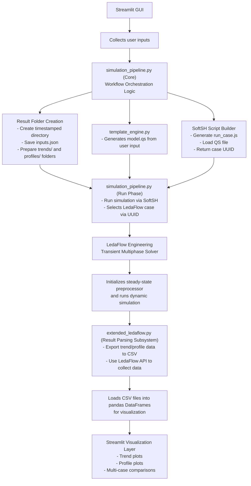

# Specialization Project - TPG4560
This repository accompanies my specialization project at NTNU during Fall 2025.
The project contributes to the ongoing research on direct offshore offloading of CO₂ within CCS value chains, as defined in the assignment description .

The academic goals were to:
- Build a simplified LedaFlow model of a CO₂ offloading system,
- Create a automated workflow simulator in a simplified streamlit GUI, and based on user input presents the LedaFlow simulated results
- Study the changes made by different variable values (BETTER THIS)

Demonstrate fully automated transient simulations.

This repository contains the complete Python workflow used to run LedaFlow simulations automatically through a custom Streamlit GUI, including templating, case generation, execution, and data analysis.

## Overview

This repository implements the **LedaRunner**, a modular automation framework built around:
- A QS templating system for programmatic manipulation of LedaFlow input files
- Automated single simulations and parameter studies
- A Python/Streamlit web interface for defining input parameters, running cases, and visualizing results
- Direct integration with the LedaFlow API and SoftSH scripting (as described in the Scripting Manual )

This workflow removes any need to:
- Modify .qs files manually
- Open the LedaFlow GUI
- Running multiple simulations to conduct a parameter study 

All simulations, including generation of input files, running transient calculations, and retrieving results, are launched directly from the browser.


## Repository Structure
```
Ledarunner/
├── README.md                       # This file - project documentation
├── LedaFlow.py                     # LedaFlow API wrapper (from installation)
├── gui_app.py                      # Streamlit GUI for automation & visualization
├── requirements.txt                # Python dependencies
│           
├── cases/                         
│   ├── CO2_pipe.qs                 # Base LedaFlow model 
│   └── template.qs                 # Parametric-friendly template with placeholders
│                 
├── automation/                     
│   ├── template_engine.py          # QS template parser and variable substitution engine
│   ├── simulation_pipeline.py      # End-to-end workflow controller
│   ├── run_softsh.py               # SoftSH command-line launcher
│   ├── extended_ledaflow.py        # Additional API utilities
│   ├── generate_template.py        # Helper function to run qs_to_template
│   └── qs_to_template.py           # Converts QS files to template format 
│               
├── results/                        
│   └── run_xx_xx /                 # Timestamped run directories
```


## System Architecture
Below is a simplified flow of how the system works: 



## Key Features

### QS Template Engine
The `template_engine.py` module dynamically constructs a `.qs` from the `template.qs`. This enables full parameterization of:
- Boundary conditions (inlet, outlet)
- Device properties (valve opening)
- Simulation time advance

**Key capabilities:**
- Automatically expands constants to arrays (`50` → `[50, 50, 50]`)
- Validation of array lengths and time-series consistency
- Clear error handling for missing or malformed inputs


**Template creation:**
Run `generate_template.py` that use `qs_to_template.py` to automatically create a template from an existing `.qs` file (e.g., `CO2_pipe.qs`). The script identifies numerical values and convert them into configurable placeholders, making it easy to parameterize any case without manual editing.

### Automated Simulation Workflow
The `simulation_pipeline.py` orchestrates and standarized all workflow steps: 

#### 1) Create result folder: 
**Single Case Mode:**
- Creates timestamped result folder containing: 
    - Generated `model.qs` file with specific parameter values
    - `trends/` and `profiles/` subdirectories with simulation outputs
    - `case_uuid.txt` for unique identification
    - `inputs.json` capturing all user-specified parameters and settings for reproducibility
    - `run_case.js` automation script for LedaFlow execution

**Parameter Study Mode:**
- Generates all parameter combinations from user-defined value lists
- Creates individual case folders within timestamped run directory 
- Each case folder contains:
    - Generated `model.qs` file with specific parameter values
    - `trends/` and `profiles/` subdirectories with simulation outputs
    - `case_uuid.txt` for unique identification
    - `inputs.json` capturing all user-specified parameters and settings for reproducibility
    - `run_case.js` automation script for LedaFlow execution


#### 2) Build final QS file
From the template.qs a model.qs file is created based on user input

### 3) Run simulation
**Single Case Mode:**
- Executes simulation via SoftSH (`run_softsh.py`) and the LedaFlow API
- Automatically extract trend and profile logger outputs

**Parameter Study Mode:**
- Runs all cases sequentially (as a single case)
- Aggregates results across cases for multi-case comparison
- Enables cross-case comparisons and visualization


### Streamlit GUI
The GUI acts as a simplified simulator interface.

**Inputs**
- Supports both constant and time-series for: 
    - Inlet mass flow & temperature
    - Valve opening
    - Outlet pressure & temperature
- Total simulation time

**Modes**
- **Single case**:
    - runs a single transient simulation
    
- **Parameter study**
    - define multiple parameter sweepsg
    - Automatic generation of all case combinations

**Visualization**
- Trend plots (time-based)
- Profile plots (position-based)
- For parameter study: 
    - Multi-case comparison


## Getting Started
1. Clone the repository
2. Install Python dependencies `pip install -r requirements.txt`
3. Ensure **LedaFlow Engineering** is installed on your system
4. Generate template (optional step)
- If you modify the original CO2_pipe.qs, you need to upload the new .qs file and regenerate the template.qs file by running `generate_template_py`
5. Launch the GUI: `python -m streamlit run gui_app.py` 
6. Configure inputs and run simulations directly from the browser

## Limitations (Student License)
This project works around several restrictions of the LedaFlow Student License:


#### 1. No .lpf case export
The full "LedaFlow Project File" cannot be exported. Only .qs scripts are available.

**Solution:** A full QS templating engine is used to build new cases programmatically.

#### 2. No built-in parameter study functionality
Only the commercial license supports multi-case sweeps.

**Solution:** Parameter study mode implemented in Python.

#### 3. Limited API capabilities
The student license cannot:
- Add or modify loggers via the API
- Modify geometry or PVT programmatically
- Change numerical discretization

**Solution:** All modifications are injected into the QS template.


## License
This project is intended for academic use and interacts with licensed LedaFlow software provided by Kongsberg.
Follow your institution’s LedaFlow license terms.